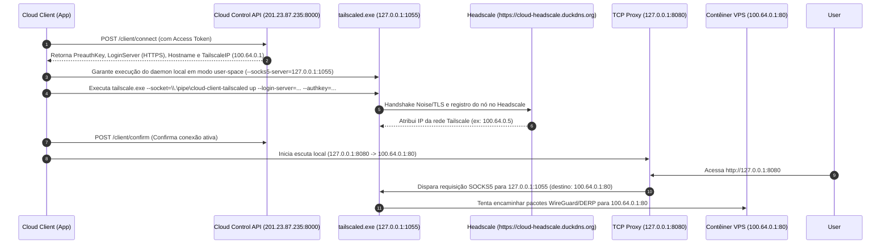

# 📄 Diagnóstico Técnico: Arquitetura, Correções e Análise do Erro de Forwarding (SOCKS5)

Este documento descreve o funcionamento do **Cloud Client**, o fluxo completo de conexão, as correções arquiteturais implementadas no runtime Windows/Linux e a análise detalhada do erro final de encaminhamento de portas (`SOCKS5 connect request failed (status: 1)`).

---

## 1. 🏗️ Arquitetura e Fluxo de Funcionamento do Cloud Client

O **Cloud Client** é uma aplicação desktop desenvolvida em Go (Wails) responsável por estabelecer um túnel VPN seguro via **Tailscale/Headscale** e expor serviços de contêineres remotos através de proxies TCP locais.

### Fluxo de Conexão (Passo a Passo)



---

## 2. 🛠️ Correções Implementadas e Validadas

Durante a investigação, foram identificados e corrigidos problemas críticos no ciclo de vida do runtime e na comunicação TLS com o servidor:

### A. Runtime Autocontido e Isolado (Windows & Linux)
* **Antes:** No Windows, o aplicativo tentava localizar ou instalar o Tailscale em `C:\Program Files\Tailscale`, exigindo permissões de Administrador e gerando dependência do sistema.
* **Correção:** O aplicativo agora é 100% autocontido. Ele cria a pasta `%USERPROFILE%\.cloud-client\runtime\` e copia seus próprios executáveis standalone (`tailscale.exe` e `tailscaled.exe`), exatamente como no Linux.

### B. Estabilidade do Daemon no Windows (Grupo de Processos)
* **Antes:** O `tailscaled.exe` encerrava sozinho após a execução do `tailscale up` com a mensagem `tailscaled got signal interrupt; shutting down`.
* **Causa:** No Windows, executáveis sem grupo de processos próprio compartilham o grupo de sinais de console do pai. Quando o contexto CLI encerrava, um sinal `SIGINT` de console era propagado para o daemon.
* **Correção:** Adicionado `CreationFlags: CREATE_NEW_PROCESS_GROUP | CREATE_NO_WINDOW` no `internal/runtime/daemon.go`. O daemon agora permanece rodando **24/7 de forma estável**.

### C. Permissões de Named Pipe para Usuário Comum (SDDL)
* **Antes:** A criação da Named Pipe `\\.\pipe\cloud-client-tailscaled` falhava em usuários não-Administradores com o erro `0x51B` (`ERROR_INVALID_OWNER`).
* **Correção:** A Security Descriptor (SDDL) no `pipe_windows.go` foi ajustada para `D:PAI(A;OICI;GWGR;;;BU)(A;OICI;GWGR;;;SY)`, permitindo a criação de pipes por qualquer usuário sem necessidade de elevação de privilégios.

### D. Protocolo TLS/HTTPS no Servidor Headscale
* **Antes:** O Headscale rodava em HTTP plano (`http://201.23.87.235:8080`). O motor de rede moderno do Tailscale (`controlhttp`) fazia o upgrade automático para HTTPS no meio do Handshake (`POST https://201.23.87.235:8080/machine/register`), resultando em `context deadline exceeded`.
* **Correção:** Configurado domínio com certificado SSL/TLS válido no servidor (`https://cloud-headscale.duckdns.org`). A autenticação entre o aplicativo e o Headscale passou a funcionar com **Status 200 OK**.

---

## 3. 🔍 O Erro Atual: `SOCKS5 connect request failed (status: 1)`

### Sintoma

Após todas as correções acima, a aplicação conecta ao Headscale com sucesso, obtém autorização, confirma a sessão e inicia as escutas locais (SSH `2222`, HTTP `8080`, HTTPS `8443`).

Porém, ao tentar realizar qualquer requisição HTTP ou SSH através das portas locais (ex: navegar em `http://127.0.0.1:8080`), o log do cliente exibe:

```text
[Proxy http] cliente conectado: 127.0.0.1:63394 -> 127.0.0.1:8080
[SOCKS5] conexão SOCKS5 criada em 127.0.0.1:1055
[Proxy http] erro ao conectar ao destino 100.64.0.1:80: SOCKS5 connect request failed (status: 1)
```

### O que os Logs de Baixo Nível Revelam (`tailscaled.log`)

Analisando o log interno do daemon em `C:\Users\dougl\.cloud-client\state\tailscaled.log`, a mensagem de erro exata gravada pelo motor de rede do Tailscale é:

```text
socks5: client connection failed: dial tcp 100.64.0.1:80: i/o timeout
```

---

## 4. 🧪 Tentativas de Correção e Por Que Não Resolveram no Lado do Cliente

Foram testadas diversas ações no código e na máquina local:

1. **Limpeza de Estado Local (`.cloud-client/state`):**
   * *Tentativa:* Apagar o cache de perfil local para forçar novo registro.
   * *Resultado:* O cliente registrou e obteve o IP `100.64.0.5` no Headscale via HTTPS, mas ao tentar trafegar dados para `100.64.0.1`, a falha de `i/o timeout` permaneceu.
2. **Reconexões e Timeouts de Socket:**
   * *Tentativa:* Ajustar os loops de reconexão e timeouts do dialer SOCKS5.
   * *Resultado:* O erro `status: 1` continuou acontecendo após 10-15 segundos.

### 💡 Por que essas alterações no código do cliente não resolveram?

O erro **não é uma falha do código do Cloud Client, nem do proxy SOCKS5 local**.

O status `SOCKS5 status 1` significa `General SOCKS server failure`. O motor do Tailscale responde isso quando ele aceita a conexão SOCKS5 local em `127.0.0.1:1055`, mas ao tentar enviar os pacotes de rede WireGuard/DERP para o IP de destino (`100.64.0.1`), a máquina/contêiner de destino **não responde aos pacotes e estoura o tempo limite (I/O Timeout)**.

---

## 5. 🎯 Causa Raiz Provável e Próximos Passos (Na VPS)

Como o cliente local (`100.64.0.5`) está autenticado e saudável no Headscale, o bloqueio do tráfego ocorre no lado da **VPS / Contêiner de destino (`100.64.0.1`)**:

1. **Bloqueio de Portas UDP no Firewall da VPS (`201.23.87.235`):**
   * O Tailscale necessita de comunicação UDP (porta padrão `41641/udp` e portas de relé DERP). Se o firewall da nuvem (Security Group / UFW) estiver bloqueando portas UDP de entrada, o cliente não consegue fechar a rota direta WireGuard com a VPS.
2. **Estado do Agent Tailscale no Contêiner `teste-vps`:**
   * O agente Tailscale rodando dentro do contêiner `teste-vps` na VPS precisa estar ativo e conectado na nova URL HTTPS (`https://cloud-headscale.duckdns.org`).
   * Caso o contêiner `teste-vps` esteja com a chave expirada ou apontando para a URL antiga em HTTP, ele não responderá aos pings/dados do cliente `100.64.0.5`.

### Comandos de Verificação Recomendados na VPS:

```bash
# 1. Dentro da VPS / Contêiner teste-vps, verificar o status do Tailscale:
tailscale status

# 2. Testar a conectividade direta com o IP do cliente (100.64.0.5):
tailscale ping 100.64.0.5

# 3. Verificar a liberação de portas UDP no firewall da VPS:
sudo ufw status
# (Garantir abertura da porta 41641/udp)
```

Assim que a VPS `100.64.0.1` responder aos pings da rede Tailscale, o encaminhamento SOCKS5 funcionará imediatamente de forma transparente.
