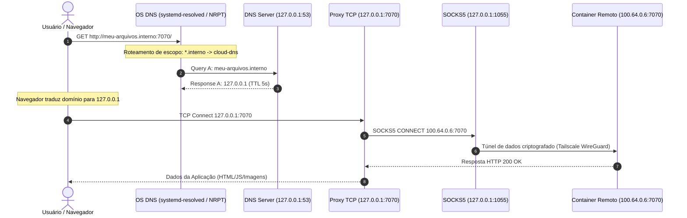

# Arquitetura Técnica do Subsistema de DNS e Proxy — Cloud Client

Este documento descreve detalhadamente a arquitetura interna, as decisões de design e o funcionamento técnico do subsistema de DNS privado e roteamento de tráfego do **Cloud Client**.

---

## 1. Visão Geral e Filosofia do Projeto

O objetivo do subsistema de rede do Cloud Client é permitir o acesso transparente a containers e serviços privados na nuvem por meio de domínios privados terminados em **`*.interno`** (ex: `http://meu-arquivos.interno:7070/`), sem que o usuário precise memorizar IPs da Tailscale ou portas remotas.

### Requisitos Invioláveis de Arquitetura:
1. **Escopo Restrito**: Apenas consultas `.interno` devem ser direcionadas ao resolvedor local (`127.0.0.1:53`).
2. **Zero Interferência na Internet**: Nenhuma interface física de rede (`enp37s0`, `wlan0`, etc.) nem o DNS do roteador/provedor (ex: `192.168.0.1`) devem ser alterados. A navegação de internet (`google.com`, `instagram.com`) deve operar de forma 100% nativa.
3. **Persistência de Link e Limpeza Limpa**: Ao reconectar ou fechar a aplicação, o sistema operacional não deve sofrer acúmulo de interfaces virtuais ou resíduos de rotas de DNS.

---

## 2. Diagrama de Sequência e Fluxo de Dados



---

## 3. O Problema da Interface Física vs. A Solução da Interface Virtual (`cloud-dns`)

### O Problema Histórico nas Placas Físicas (`enp37s0`)
Inicialmente, tentou-se aplicar a regra de roteamento `~interno` diretamente na placa física:
```bash
# ABORDAGEM ANTIGA (PROBLEMÁTICA):
resolvectl dns enp37s0 127.0.0.1
resolvectl domain enp37s0 ~interno
```
**Por que isso quebrava a internet?**
Quando o `systemd-resolved` observava que a placa `enp37s0` possuía apenas o servidor `127.0.0.1` e a regra `~interno` (onde o prefixo `~` indica escopo exclusivo de roteamento), o daemon removia o escopo global da placa, marcando-a como **`-DefaultRoute`**. Como consequência, todas as consultas para domínios de internet (`google.com`) deixavam de ter um gateway DNS de saída, resultando no erro `Could not resolve host`.

### A Solução Técnica: Interface Virtual `dummy` Dedicada
Para isolar 100% o subsistema de DNS privado sem tocar na placa física, o Linux utiliza uma interface virtual do tipo **`dummy`** chamada **`cloud-dns`**.

```text
  ┌────────────────────────────────────────────────────────────────────────┐
  │                           SISTEMA OPERACIONAL                          │
  │                                                                        │
  │  ┌─────────────────────────┐            ┌───────────────────────────┐  │
  │  │  Link 2: enp37s0        │            │  Link 7: cloud-dns        │  │
  │  │  (Placa Física de Rede) │            │  (Interface Virtual)      │  │
  │  │                         │            │                           │  │
  │  │  IP: 192.168.0.X        │            │  IP: 192.168.254.254/32   │  │
  │  │  DNS: 192.168.0.1       │            │  DNS: 127.0.0.1:53        │  │
  │  │  Scope: +DefaultRoute   │            │  Scope: ~interno          │  │
  │  └────────────┬────────────┘            └─────────────┬─────────────┘  │
  └───────────────┼───────────────────────────────────────┼────────────────┘
                  │                                       │
                  ▼                                       ▼
      Internet Geral (google.com)             Domínios Privados (*.interno)
```

---

## 4. Detalhamento Interno da Interface Virtual `cloud-dns`

### 4.1. Por que atribuir o IP `192.168.254.254/32`?
O `systemd-resolved` possui uma regra de ciclo de vida de rede: ele **somente ativa um Escopo DNS (`Current Scopes: DNS`)** em interfaces de rede que possuem um endereço IP de Camada 3 (L3) configurado e em estado `UP`.

Se a interface `dummy` for criada sem um endereço IP:
```text
Link 7 (cloud-dns)
    Current Scopes: none   <-- Ignorado pelo systemd-resolved!
```
Ao atribuir o IP fictício estático `192.168.254.254/32` via `ip addr add`:
```text
Link 7 (cloud-dns)
    Current Scopes: DNS    <-- Ativado e operacional!
```

### 4.2. Reaproveitamento de Interface e Fixação de `ifindex`
No Kernel do Linux, toda vez que uma interface de rede é criada e deletada (`ip link add` / `ip link delete`), o Kernel atribui um identificador sequencial incremental (`ifindex`). Se o app deletasse a interface a cada parada:
- 1ª conexão: `Link 7 (cloud-dns)`
- 2ª conexão: `Link 8 (cloud-dns)`
- 3ª conexão: `Link 9 (cloud-dns)`

**A Solução de Reaproveitamento no Go (`dns_integration_linux.go`)**:
1. No `Enable()`: O código verifica se a interface `cloud-dns` já existe (`net.InterfaceByName("cloud-dns")`). Se já existir, **não a recria**. Apenas garante que ela está em estado `UP` e reaplica as regras do `resolvectl`.
2. No `Disable()`: O código executa `resolvectl revert cloud-dns` (limpando o escopo de DNS) e coloca o link em estado `DOWN` (`ip link set dev cloud-dns down`), **sem deletar a interface do Kernel**.

Dessa forma, o índice da interface permanece **fixo (ex: Link 7)** indefinidamente.

---

## 5. Por que o DNS responde `127.0.0.1` em vez do IP Tailscale (`100.64.0.6`)

Quando o servidor DNS local (`dns_resolver.go`) recebe uma consulta para `meu-arquivos.interno`, ele consulta o registro e sabe que o IP do container é `100.64.0.6`. No entanto, ele responde com **`127.0.0.1`**:

```go
// internal/network/dns_resolver.go
rr := &dns.A{
    Hdr: dns.RR_Header{
        Name:   q.Name,
        Rrtype: dns.TypeA,
        Class:  dns.ClassINET,
        Ttl:    5,
    },
    A: net.ParseIP("127.0.0.1").To4(),
}
```

### Por que essa resposta é crucial?
1. **Ausência de Rota IP Direta**: A tabela de roteamento do sistema operacional local não possui uma rota direta para o bloco `100.64.0.0/10` (Tailscale opera em modo *userspace-networking* via SOCKS5 na porta `1055`).
2. **Direcionamento ao Proxy Local**: Ao responder `127.0.0.1`, o navegador abre a conexão TCP diretamente na porta local (ex: `127.0.0.1:7070`).
3. **Encaminhamento Transparente**: O proxy TCP local (`proxy.go`) intercepta a conexão em `127.0.0.1:7070`, abre o túnel SOCKS5 para o `tailscaled` em `127.0.0.1:1055` e encaminha os dados para o destino final `100.64.0.6:7070`.

---

## 6. Comandos Executados no Ciclo de Vida (Linux)

### 6.1. Ativação (`Enable`):
```bash
# 1. Cria a interface dummy (apenas se não existir)
ip link add dev cloud-dns type dummy

# 2. Atribui o IP estático de Camada 3
ip addr add 192.168.254.254/32 dev cloud-dns

# 3. Ativa a interface
ip link set dev cloud-dns up

# 4. Configura o systemd-resolved na interface dedicada
resolvectl dns cloud-dns 127.0.0.1
resolvectl domain cloud-dns ~interno
resolvectl default-route cloud-dns false

# 5. Flush de cache
resolvectl reset-server-features
resolvectl flush-caches
```

### 6.2. Desativação (`Disable`):
```bash
# 1. Limpa as regras do systemd-resolved na interface
resolvectl revert cloud-dns

# 2. Coloca o link em estado DOWN (preservando o ifindex)
ip link set dev cloud-dns down

# 3. Flush de cache
resolvectl flush-caches
```

---

## 7. Integração Nativa no Windows (NRPT)

No Windows (`dns_integration_windows.go`), não é necessário criar interfaces virtuais porque o sistema operacional possui suporte nativo à **NRPT (Name Resolution Policy Table)**.

### Comandos PowerShell aplicados no Windows:

**Ativação:**
```powershell
Add-DnsClientNrptRule -Namespace '.interno' -NameServers '127.0.0.1' -Comment 'CloudClient-Internal-DNS'
ipconfig /flushdns
```

**Desativação:**
```powershell
Get-DnsClientNrptRule | Where-Object { $_.Comment -eq 'CloudClient-Internal-DNS' } | Remove-DnsClientNrptRule -Force
ipconfig /flushdns
```

---

## 8. Diagnóstico e Verificação de Estado

### Como interpretar o `resolvectl status` no Linux:

#### Estado Conectado (Correto):
```text
Link 2 (enp37s0)
    Current Scopes: DNS
         Protocols: +DefaultRoute -LLMNR -mDNS -DNSOverTLS DNSSEC=no/unsupported
Current DNS Server: 192.168.0.1
       DNS Servers: 192.168.0.1

Link 7 (cloud-dns)
    Current Scopes: DNS
         Protocols: -DefaultRoute -LLMNR -mDNS -DNSOverTLS DNSSEC=no/unsupported
Current DNS Server: 127.0.0.1
       DNS Servers: 127.0.0.1
        DNS Domain: ~interno
```

#### Estado Desconectado (Correto):
```text
Link 2 (enp37s0)
    Current Scopes: DNS
         Protocols: +DefaultRoute -LLMNR -mDNS -DNSOverTLS DNSSEC=no/unsupported
Current DNS Server: 192.168.0.1
       DNS Servers: 192.168.0.1

Link 7 (cloud-dns)
    Current Scopes: none
         Protocols: -DefaultRoute -LLMNR -mDNS -DNSOverTLS DNSSEC=no/unsupported
```

---

## 9. Mapeamento de Arquivos do Código Fonte

| Arquivo | Função Técnica |
|---|---|
| [`internal/network/dns_integration_linux.go`](file:///home/douglas/Documents/teste-final-cloud-cliente/internal/network/dns_integration_linux.go) | Gerencia o ciclo de vida da interface virtual `cloud-dns` e comandos `resolvectl` / `ip link` no Linux. |
| [`internal/network/dns_integration_windows.go`](file:///home/douglas/Documents/teste-final-cloud-cliente/internal/network/dns_integration_windows.go) | Gerencia as regras NRPT via PowerShell no Windows. |
| [`internal/network/dns_resolver.go`](file:///home/douglas/Documents/teste-final-cloud-cliente/internal/network/dns_resolver.go) | Lógica do servidor DNS Miekg em Go: intercepta `.interno` e responde `127.0.0.1`. |
| [`internal/network/dns_server.go`](file:///home/douglas/Documents/teste-final-cloud-cliente/internal/network/dns_server.go) | Socket listener UDP/TCP na porta `127.0.0.1:53`. |
| [`internal/network/network_manager.go`](file:///home/douglas/Documents/teste-final-cloud-cliente/internal/network/network_manager.go) | Orquestrador principal do subsistema de rede e sincronização de endpoints da nuvem. |
